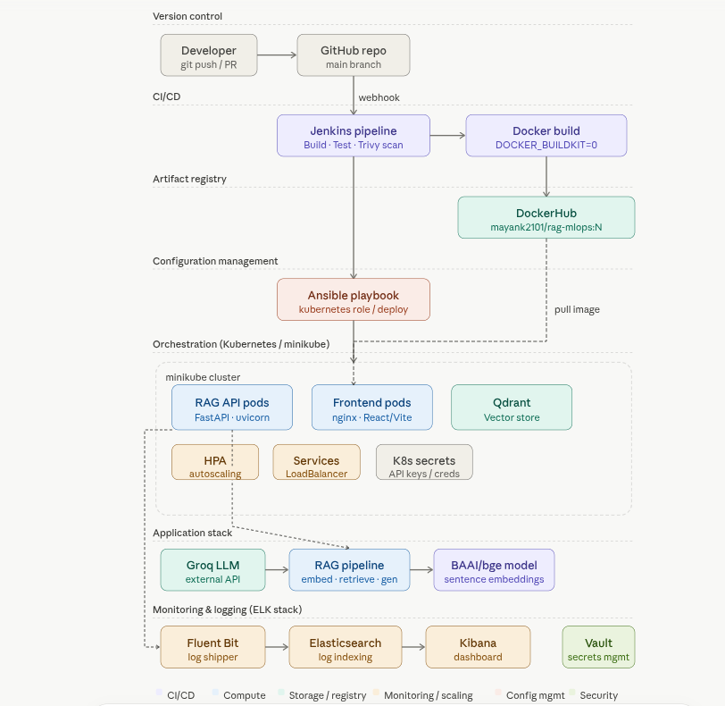

<div align="center">

# 🤖 RAG MLOps System
### Production-grade AI Troubleshooting Assistant — End-to-End MLOps Pipeline

[](https://python.org)
[](https://fastapi.tiangolo.com)
[](https://docker.com)
[](https://kubernetes.io)
[](https://jenkins.io)
[](LICENSE)

<br/>

> **Not just an AI chatbot. A battle-tested, production-ready MLOps pipeline** — from a GitHub push to a Kubernetes-orchestrated, auto-scaling, ELK-monitored AI service.

<br/>



</div>

---

## 🎯 What Is This?

This project is a **laptop troubleshooting AI assistant** powered by Retrieval-Augmented Generation (RAG) — but the real story is the **infrastructure it runs on**.

Most AI side projects are a Python script calling an LLM API. This one ships with:

- ✅ A **Jenkins CI/CD pipeline** triggered by GitHub webhooks — builds, tests, scans, pushes to DockerHub automatically
- ✅ A **Kubernetes cluster** (minikube) with HPA autoscaling, rolling deployments, zero-downtime updates, and K8s Secrets
- ✅ An **Ansible playbook** for fully automated cluster provisioning and deployment
- ✅ An **ELK-stack monitoring layer** (Fluent Bit → Elasticsearch → Kibana) with structured JSON logs
- ✅ A **React frontend** with GSAP animations, streaming responses, and a live debug panel

---

## 🏗️ System Architecture

```
Developer → GitHub → Jenkins Pipeline → Docker Build → DockerHub
                                                              ↓
                              Ansible Playbook ← pulls image ─┘
                                      ↓
                         Kubernetes / minikube cluster
                         ┌────────────────────────────────────────┐
                         │  RAG API Pods    Frontend Pods  Qdrant  │
                         │  (FastAPI/uvicorn) (nginx/React) (Vector│
                         │                                  Store) │
                         │  HPA  ·  Services  ·  K8s Secrets       │
                         └────────────────────────────────────────┘
                                      ↓
                    Application Stack: Groq LLM → RAG Pipeline → BAAI/bge
                                      ↓
                    Monitoring: Fluent Bit → Elasticsearch → Kibana
                                                    + Vault (secrets mgmt)
```

### Pipeline Flow (What happens on `git push`)

| Step | Tool | What it does |
|------|------|--------------|
| 1 | GitHub webhook | Triggers Jenkins build |
| 2 | Jenkins | Installs deps, runs pytest with JUnit reporting |
| 3 | Trivy | Scans Docker image for CVEs |
| 4 | Docker | Builds multi-layer image with `DOCKER_BUILDKIT=1` for layer caching |
| 5 | DockerHub | Pushes `mayank2101/rag-mlops:N` |
| 6 | Ansible | SSHes into node, applies Kubernetes role |
| 7 | Kubernetes | Rolling update — zero downtime |
| 8 | HPA | Scales 2–5 pods based on CPU (>60%) and memory (>75%) |

---

## 🧠 RAG Architecture — The AI Core

The retrieval pipeline goes well beyond a simple vector search:

```
User Question
     ↓
QueryGenerator (Groq Llama-3.1-8B)
     ↓  generates N semantically diverse re-phrasings
MultiQueryRetriever
     ↓  parallel async Qdrant searches (one per query)
     ↓  union + deduplication by source
Reranker (bge-reranker-base cross-encoder)
     ↓  re-scores all candidates for semantic relevance
Top-K Chunks → AdvancedQAPipeline
     ↓  injects conversation history + context
Groq LLM (final answer generation)
     ↓
Answer + Sources + Debug metadata
```

### Why Multi-Query?
A single query like *"laptop won't turn on"* misses documents indexed under *"no POST on boot"* or *"power delivery failure"*. The `QueryGenerator` creates 3 semantically distinct variants, all searched in parallel — nearly zero extra latency.

### Why Cross-Encoder Reranking?
Bi-encoder similarity (used in vector search) is fast but imprecise — it can't reason about query-document interaction. The `bge-reranker-base` cross-encoder re-scores retrieved chunks for true relevance, dramatically improving answer quality.

---

## 🛠️ Tech Stack

| Layer | Technology |
|-------|------------|
| **LLM** | Groq (Llama-3.1-8B-Instruct) — low-latency inference |
| **Embeddings** | BAAI/bge-base-en-v1.5 (sentence-transformers) |
| **Reranker** | bge-reranker-base (cross-encoder) |
| **Vector DB** | Qdrant (StatefulSet in Kubernetes) |
| **API** | FastAPI + uvicorn with async support |
| **Frontend** | React + Vite + GSAP animations |
| **CI/CD** | Jenkins (Jenkinsfile, GitHub webhook trigger) |
| **Containers** | Docker with BuildKit layer caching |
| **Registry** | DockerHub (`mayank2101/rag-mlops`) |
| **Orchestration** | Kubernetes / minikube |
| **Config Mgmt** | Ansible (roles: common, docker, kubernetes, monitoring, rag_app) |
| **Autoscaling** | HPA — CPU >60%, Memory >75%, 2–5 replicas |
| **Log Shipping** | Fluent Bit (tailing JSON app logs) |
| **Log Indexing** | Elasticsearch |
| **Dashboards** | Kibana |
| **Secrets** | Kubernetes Secrets + Vault |
| **Testing** | pytest + JUnit XML reporting in Jenkins |

---

## 🚀 Quick Start

### Prerequisites

```bash
# Required
docker
minikube
kubectl
ansible
python >= 3.11
```

### 1 — Clone & Configure

```bash
git clone https://github.com/<your-username>/rag-mlops-system.git
cd rag-mlops-system
cp .env.example .env
```

Edit `.env`:

```env
GROQ_API_KEY=your_groq_api_key_here
QDRANT_HOST=localhost
QDRANT_PORT=6333
COLLECTION_NAME=laptop_docs
LOG_LEVEL=INFO
```

### 2 — Local Development (Docker Compose)

The fastest way to run everything locally:

```bash
docker compose up --build
```

Services started:
- API: `http://localhost:8000` → Swagger UI at `/docs`
- Frontend: `http://localhost:3000`
- Qdrant: `http://localhost:6333`
- Kibana: `http://localhost:5601`
- Elasticsearch: `http://localhost:9200`

### 3 — Ingest Knowledge Base

```bash
# Ingest via script
python scripts/ingest_texts.py

# Or via API (upload a .txt file)
curl -X POST http://localhost:8000/api/v1/ingest \
  -F "file=@your_manual.txt"
```

### 4 — Ask a Question

```bash
curl -X POST http://localhost:8000/api/v1/advanced-query \
  -H "Content-Type: application/json" \
  -d '{"question": "My laptop screen flickers randomly", "session_id": "user-001"}'
```

---

## ☸️ Kubernetes Deployment

### Via Ansible (Automated)

```bash
cd ansible
ansible-playbook -i inventory/hosts.yml site.yml --ask-vault-pass
```

This runs all roles in order: `common → docker → kubernetes → rag_app → monitoring`

### Manual kubectl

```bash
minikube start --memory=4096 --cpus=4

kubectl apply -f k8s/namespace.yaml
kubectl apply -f k8s/secret.yaml
kubectl apply -f k8s/configmap.yaml
kubectl apply -f k8s/qdrant-statefulset.yaml
kubectl apply -f k8s/qdrant-service.yaml
kubectl apply -f k8s/backend-deployment.yaml
kubectl apply -f k8s/backend-service.yaml
kubectl apply -f k8s/frontend-deployment.yaml
kubectl apply -f k8s/frontend-service.yaml
kubectl apply -f k8s/hpa.yaml

# Verify
kubectl get pods -n rag-system
kubectl get hpa -n rag-system
```

### Access the App

```bash
minikube service rag-frontend -n rag-system
# or
kubectl port-forward svc/rag-backend 8000:8000 -n rag-system
```

---

## 🔁 CI/CD Pipeline

The `Jenkinsfile` defines the full pipeline. What runs on every `git push`:

```
Stage 1: Install Dependencies
  └── pip install requirements-ci.txt + ansible + kubectl

Stage 2: Run Tests
  └── pytest --junitxml=test-results/results.xml
  └── JUnit results published to Jenkins UI

Stage 3: Build Docker Image
  └── DOCKER_BUILDKIT=1 docker build (layer caching)
  └── Prunes dangling images to save disk

Stage 4: Trivy Security Scan
  └── Scans for HIGH/CRITICAL CVEs
  └── Non-blocking (continue-on-error) — alerts without blocking deploy

Stage 5: Push to DockerHub
  └── Tags as :latest and :BUILD_NUMBER
  └── Credentials from Jenkins secrets store

Stage 6: Ansible Deploy
  └── ansible-playbook site.yml → kubernetes role
  └── kubectl rollout status to wait for readiness
```

Pipeline config:
- Builds retained: last 5 builds, last 10 days
- Max runtime: 90 minutes (cold cache) / ~2 minutes (warm cache)
- Trigger: `githubPush()` webhook

---

## 📁 Project Structure

```
rag-mlops-system/
│
├── src/
│   ├── api/
│   │   ├── app.py              # FastAPI app, CORS, lifespan hooks
│   │   ├── routes.py           # All API endpoints
│   │   ├── models.py           # Pydantic request/response schemas
│   │   └── dependencies.py     # Singleton resource injection
│   │
│   ├── retrieval/
│   │   ├── query_generator.py  # LLM-based multi-query expansion
│   │   ├── multi_retriever.py  # Parallel async Qdrant search + dedup
│   │   ├── reranker.py         # Cross-encoder reranking
│   │   └── retriever.py        # Base Qdrant retriever
│   │
│   ├── generation/
│   │   ├── advanced_qa_chain.py # Full RAG orchestrator
│   │   ├── llm_client.py        # Groq API wrapper
│   │   └── prompt_templates.py  # System/user prompts
│   │
│   ├── ingestion/
│   │   ├── embedder.py          # BAAI/bge embedding
│   │   ├── indexer.py           # Qdrant upsert + collection management
│   │   └── text_loader.py       # .txt file chunking
│   │
│   ├── memory/
│   │   └── conversation_memory.py # Session-scoped chat history
│   │
│   └── utils/
│       ├── config.py            # Pydantic Settings (env vars)
│       ├── logger.py            # Loguru structured JSON logging
│       └── timer.py             # Timing decorators
│
├── frontend/                   # React + Vite app
│   └── src/components/         # ChatWindow, DebugPanel, Sidebar, Header
│
├── k8s/                        # Kubernetes manifests
│   ├── backend-deployment.yaml # Rolling update, resource limits
│   ├── hpa.yaml                # CPU + memory autoscaling
│   ├── qdrant-statefulset.yaml # Persistent vector store
│   └── secret.yaml             # API keys (base64 encoded)
│
├── ansible/                    # Infrastructure automation
│   ├── site.yml                # Master playbook
│   └── roles/                  # common / docker / kubernetes / monitoring / rag_app
│
├── fluent-bit/                 # Log shipping config
├── jenkins/                    # Jenkins Dockerfile
├── tests/                      # pytest test suite
├── scripts/                    # ingest_texts.py, test_query.py
├── Dockerfile                  # Multi-stage build
├── Jenkinsfile                 # CI/CD pipeline definition
└── docker-compose.yml          # Full local stack
```

---

## 🌐 API Reference

Base URL: `http://localhost:8000/api/v1`

| Method | Endpoint | Description |
|--------|----------|-------------|
| `POST` | `/ingest` | Upload a `.txt` file to the knowledge base |
| `POST` | `/advanced-query` | Ask a question (multi-query + rerank + memory) |
| `POST` | `/advanced-query/debug` | Same as above + retrieval debug info |
| `DELETE` | `/history/{session_id}` | Clear conversation memory |
| `POST` | `/reindex` | Reindex the entire knowledge base |
| `GET` | `/health` | Liveness probe (Docker/K8s) |
| `GET` | `/ready` | Readiness probe (checks all dependencies) |
| `GET` | `/stats` | Collection statistics |

Interactive docs: `http://localhost:8000/docs`

---

## 📊 Monitoring

Logs flow: **FastAPI (Loguru JSON)** → **Fluent Bit** → **Elasticsearch** → **Kibana**

Every request is logged with:
```json
{
  "method": "POST",
  "path": "/api/v1/advanced-query",
  "status_code": 200,
  "latency_ms": 312.4,
  "service": "rag-api",
  "env": "production"
}
```

Kibana dashboard available at `http://localhost:5601` — index pattern: `rag-logs`.

---

## 🧪 Testing

```bash
# Run tests locally
python -m pytest -v --tb=short

# With coverage
pytest --cov=src tests/

# Individual test
pytest tests/test_health.py -v
```

Tests cover: health endpoints, reindex pipeline, API contracts.

---

## 🔐 Security

- **Trivy** scans every Docker image for CVEs before deployment
- **Kubernetes Secrets** stores all API keys and credentials
- **Ansible Vault** encrypts secrets in `group_vars/all/vault.yml`
- **K8s Secrets** injected as environment variables — never hardcoded
- `.env` is gitignored; use `.env.example` as a template

---

## 🤝 Contributing

```bash
# Fork and clone
git checkout -b feature/your-feature

# Make changes, run tests
pytest -v

# Push and open a PR against main
git push origin feature/your-feature
```

The Jenkins webhook will automatically run the full CI pipeline against your PR.

---

## 📄 License

MIT License — see [LICENSE](LICENSE) for details.

---

<div align="center">

Built with 🔥 by **Kashyap Dhameliya**  
MTech CSE · IIIT Bangalore

*If this project helped you, drop a ⭐ — it means a lot.*

</div>
